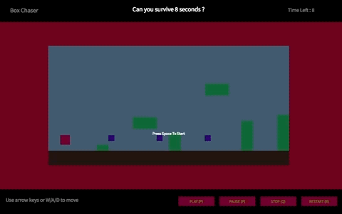

# PRESTO SVG Clock

PrestoDOM is a new in-development UI library written in PureScript language by Juspay Technologies Pvt. Ltd.

This repository showcases the capabilities of the library by making a Box Chaser game that you can play with the keyboard.

**PS**: The PrestoDOM library is internal at the moment, so you need access to it in order to compile this source code. We are going to open source it soon, so until then, you can browse the code to see how it is done. This notice will be removed once the code is made public for everyone.

## Demo
https://amitrohan.github.io/presto-svg-clock/

## Cloning the repository

~~~sh
$ git clone https://github.com/AmitRohan/presto-mario/
$ npm i
$ bower i
~~~

## Running in the server

~~~sh
$ npm start
~~~

Once that is done, browse to http://localhost:8080/ to play the game.

## Compiling for distribution

~~~sh
$ npm run compile-ps
$ npm run compile-js
~~~

Now package everything in the dist directory and distribute.

## About	
		
**Why SVG?**
SVG has some advantages over conventional bitmapped graphics, such as JPEG, GIF, and PNG, used in the browser environment, because of several reasons:

		1)	The files are generally much smaller than bitmaps, resulting in quicker download times.
		2) The graphics can be scaled to fit different display devices without the pixelation associated with enlarging bitmaps.
		3) The graphics are constructed within the browser, reducing the server load and network response time generally associated with web imagery. That is, a typically small formulaic description is sent from the server to the client. The client then reconstructs the imagery based on the formulas it receives.
		4) The end-user can interact with and change the graphics without need for complex and costly client-server communications.
		5) It provides native support for SMIL (Synchronized Media Integration Language) meaning that animations, for example, are supported with a more analog notion of timing, hence freeing the programmer from timed loops typically used in JavaScript-based animations.
		
